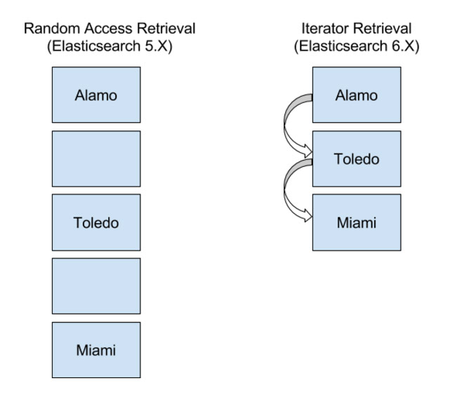

# ES6存储空间优化

{% embed data="{\"url\":\"https://www.elastic.co/blog/minimize-index-storage-size-elasticsearch-6-0\",\"type\":\"link\",\"title\":\"Space Saving Improvements in Elasticsearch 6.0\",\"description\":\"Elasticsearch 6.0 ships with two great improvements to help minimize index storage size. The best part about the improvements is they will require no special configuration changes or re-architectures,...\",\"icon\":{\"type\":\"icon\",\"url\":\"https://www.elastic.co/android-chrome-192x192.png\",\"width\":192,\"height\":192,\"aspectRatio\":1},\"thumbnail\":{\"type\":\"thumbnail\",\"url\":\"https://www.elastic.co/assets/blta4b74585cdad3d9b/elasticsearch-space-saving-improvements-thumbnail.jpeg\",\"width\":724,\"height\":420,\"aspectRatio\":0.580110497237569}}" %}

* 废弃\_all字段
* LUCENE7优化了稀疏域docvalue的存储

