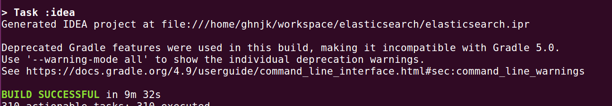
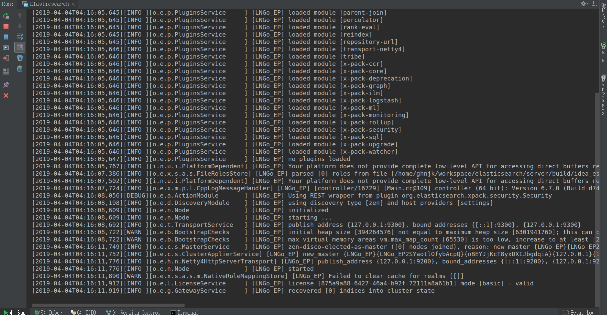

# 准备工作

## 工具安装

- JDK安装11+
- intellij IDEA

##  gradle环境配置

如果Gradle在编译的时候没有在本地仓库中发现依赖，就会从远程仓库中下载，默认的远程仓库为mavenCentral()，也就是http://repo1.maven.org/maven2/，但是往往访问速度特别慢，不翻墙经常会下载超时或者需要很长时间导致Build失败，因此，可以用国内的仓库代替：

阿里的仓库地址：http://maven.aliyun.com/nexus/content/groups/public/
OSChina的仓库地址：http://maven.oschina.net/content/groups/public/

 - 可以在USER_HOME/.gradle/文件夹下添加init.gradle文件来配置

```
allprojects{
    repositories {
        def REPOSITORY_URL = 'http://maven.aliyun.com/nexus/content/groups/public/'
        all { ArtifactRepository repo ->
            if(repo instanceof MavenArtifactRepository){
                def url = repo.url.toString()
                if (url.startsWith('https://repo1.maven.org/maven2') || url.startsWith('https://jcenter.bintray.com/')) {
                    remove repo
                }
            }
        }
        maven {
            url REPOSITORY_URL
        }
    }
}
```

## 导入工程

- 执行gradle idea

``` 
./gradlew idea
```



 - 通过idea导入项目

> Configure project :benchmarks
> =======================================
> Elasticsearch Build Hamster says Hello!
>   Gradle Version        : 5.2.1
>   OS Info               : Linux 4.13.0-43-generic (amd64)
>   JDK Version           : 11 (Oracle Corporation 11.0.2 [Java HotSpot(TM) 64-Bit Server VM 11.0.2+9-LTS])
>   JAVA_HOME             : /usr/local/jdk-11.0.2
>   Random Testing Seed   : 541A88CC3E1C1F22编译打包

```
./gradlew distTar
```

## 在IDEA运行

```
ES_IDEA_HOME=/home/ghnjk/workspace/elasticsearch/server/build/idea_es_home
mkdir -p ${ES_IDEA_HOME}
cd ${ES_IDEA_HOME}
mkdir -p logs data
# 从官网下载发行包，拷贝如下目录到当前目录config, plugins modules
vim config/elasticsearch.yml # 编辑配置文件

```

 - 配置IDEA启动参数

```
main class: org.elasticsearch.bootstrap.Elasticsearch

VM option: -Des.path.home=/home/ghnjk/workspace/elasticsearch/server/build/idea_es_home -Des.path.conf=/home/ghnjk/workspace/elasticsearch/server/build/idea_es_home/config -Dlog4j2.disable.jmx=true

working directory: /home/ghnjk/workspace/elasticsearch/server/build/idea_es_home

use classpath of modules: server
```

 -  libs模块的类加载问题

```
java.lang.NoClassDefFoundError: org/elasticsearch/plugins/ExtendedPluginsClassLoader
```

解决方法：这个类在libs模块，server模块中原来的gradle配置是

```
compileOnly project(':libs:plugin-classloader')
```
compileOnly改为compile即可。

java security权限设置问题

```
报错：
ERROR Could not register mbeans java.security.AccessControlException: access denied ("javax.management.MBeanTrustPermission" "register")
Caused by: java.security.AccessControlException: access denied ("java.lang.RuntimePermission" "createClassLoader")
```
在server模块找到src\main\resources\org\elasticsearch\bootstrap\security.policy文件，在grant{}中添加上相应的permission
```
  permission javax.management.MBeanTrustPermission "register";
  permission java.lang.RuntimePermission "createClassLoader";
```


## 运行成功



```
curl -s http://127.0.0.1:9200/
{
  "name" : "LNGo_EP",
  "cluster_name" : "my-application",
  "cluster_uuid" : "GTI-kk9BSSiv5VjsDLUcMQ",
  "version" : {
    "number" : "6.7.0",
    "build_flavor" : "unknown",
    "build_type" : "unknown",
    "build_hash" : "Unknown",
    "build_date" : "Unknown",
    "build_snapshot" : true,
    "lucene_version" : "7.7.0",
    "minimum_wire_compatibility_version" : "5.6.0",
    "minimum_index_compatibility_version" : "5.0.0"
  },
  "tagline" : "You Know, for Search"
}
```


##  gradle任务列表

```
Application tasks
-----------------
run - Runs this project as a JVM application
runShadow - Runs this project as a JVM application using the shadow jar
startShadowScripts - Creates OS specific scripts to run the project as a JVM application using the shadow jar

Benchmark tasks
---------------
jmh - Runs all microbenchmarks
jmhJar - Generates an uberjar with the microbenchmarks and all dependencies

Build tasks
-----------
assemble - Assembles the outputs of this project.
build - Assembles and tests this project.
buildDependents - Assembles and tests this project and all projects that depend on it.
buildNeeded - Assembles and tests this project and all projects it depends on.
classes - Asse{
  "name" : "LNGo_EP",
  "cluster_name" : "my-application",
  "cluster_uuid" : "GTI-kk9BSSiv5VjsDLUcMQ",
  "version" : {
    "number" : "6.7.0",
    "build_flavor" : "unknown",
    "build_type" : "unknown",
    "build_hash" : "Unknown",
    "build_date" : "Unknown",
    "build_snapshot" : true,
    "lucene_version" : "7.7.0",
    "minimum_wire_compatibility_version" : "5.6.0",
    "minimum_index_compatibility_version" : "5.0.0"
  },
  "tagline" : "You Know, for Search"
}mbles main classes.
clean - Deletes the build directory.
jar - Assembles a jar archive containing the main classes.
java9Classes - Assembles java9 classes.
javadocJar - Assembles a jar containing javadocs.
sourcesJar - Assembles a jar containing source files.
testClasses - Assembles test classes.
war - Generates a war archive with all the compiled classes, the web-app content and the libraries.

Build Setup tasks
-----------------
init - Initializes a new Gradle build.
wrapper - Generates Gradle wrapper files.

Distribution tasks
------------------
assembleDist - Assembles the main distributions
assembleShadowDist - Assembles the shadow distributions
distTar - Bundles the project as a distribution.
distZip - Bundles the project as a distribution.
installDist - Installs the project as a distribution as-is.
installShadowDist - Installs the project as a distribution as-is.
shadowDistTar - Bundles the project as a distribution.
shadowDistZip - Bundles the project as a distribution.

Docs tasks
----------
listConsoleCandidates
listSnippets - List each snippet

Documentation tasks
-------------------
groovydoc - Generates Groovydoc API documentation for the main source code.
javadoc - Generates Javadoc API documentation for the main source code.

Help tasks
----------
buildEnvironment - Displays all buildscript dependencies declared in root project 'elasticsearch'.
components - Displays the components produced by root project 'elasticsearch'. [incubating]
dependencies - Displays all dependencies declared in root project 'elasticsearch'.
dependencyInsight - Displays the insight into a specific dependency in root project 'elasticsearch'.
dependentComponents - Displays the dependent components of components in root project 'elasticsearch'. [incubating]
help - Displays a help message.
model - Displays the configuration model of root project 'elasticsearch'. [incubating]
projects - Displays the sub-projects of root project 'elasticsearch'.
properties - Displays the properties of root project 'elasticsearch'.
tasks - Displays the tasks runnable from root project 'elasticsearch' (some of the displayed tasks may belong to subprojects).

IDE tasks
---------
cleanEclipse - Cleans all Eclipse files.
cleanEclipseWtp - Cleans Eclipse wtp configuration files.
cleanIdea - Cleans IDEA project files (IML, IPR)
cleanIdeaBuildDir - Deletes the IDEA build directory.
eclipse - Generates all Eclipse files.
eclipseWtp - Generates Eclipse wtp configuration files.
idea - Generates IDEA project files (IML, IPR, IWS)
openIdea - Opens the IDEA project

Plugin development tasks
------------------------
pluginDescriptors - Generates plugin descriptors from plugin declarations.
pluginUnderTestMetadata - Generates the metadata for plugin functional tests.
validateTaskProperties - Validates task property annotations for the plugin.

Publishing tasks
----------------
generateMetadataFileForClientJarPublication - Generates the Gradle metadata file for publication 'clientJar'.
generateMetadataFileForNebulaPublication - Generates the Gradle metadata file for publication 'nebula'.
generateMetadataFileForNebulaRealPomPublication - Generates the Gradle metadata file for publication 'nebulaRealPom'.
generateMetadataFileForPluginMavenPublication - Generates the Gradle metadata file for publication 'pluginMaven'.
generatePomFileForClientJarPublication - Generates the Maven POM file for publication 'clientJar'.
generatePomFileForNebulaPublication - Generates the Maven POM file for publication 'nebula'.
generatePomFileForNebulaRealPomPublication - Generates the Maven POM file for publication 'nebulaRealPom'.
generatePomFileForPluginMavenPublication - Generates the Maven POM file for publication 'pluginMaven'.
publish - Publishes all publications produced by this project.
publishClientJarPublicationToMavenLocal - Publishes Maven publication 'clientJar' to the local Maven repository.
publishNebulaPublicationToMavenLocal - Publishes Maven publication 'nebula' to the local Maven repository.
publishNebulaRealPomPublicationToMavenLocal - Publishes Maven publication 'nebulaRealPom' to the local Maven repository.
publishPluginMavenPublicationToMavenLocal - Publishes Maven publication 'pluginMaven' to the local Maven repository.
publishToMavenLocal - Publishes all Maven publications produced by this project to the local Maven cache.

Shadow tasks
------------
knows - Do you know who knows?
shadowJar - Create a combined JAR of project and runtime dependencies

Verification tasks
------------------
branchConsistency - Ensures this branch is internally consistent. For example, that versions constants match released versions.
bwcTest - Runs backwards compatibility tests.
check - Runs all checks.
integTest - Runs rest tests against an elasticsearch cluster.
internalClusterTest - Multi-node tests
listAllBoxes - List all vagrant boxes which can be tested by this plugin
listAvailableBoxes - List all vagrant boxes which are available for testing
packagingTest - Tests distribution installation on different platforms using vagrant. See TESTING.asciidoc for details.
platformTest - Test unit and integ tests on different platforms using vagrant. See TESTING.asciidoc for details. This test is unmaintained.
precommit - Runs all non-test checks.
run - Runs elasticsearch in the foreground
runqa - Runs elasticsearch with ':x-pack:qa:sql:multinode'
stop - Stop any tasks from tests that still may be running
test - Runs unit tests with the randomized testing framework
vagrantCheckVersion - Check the Vagrant version
vagrantSmokeTest - Smoke test the specified vagrant boxes
virtualboxCheckVersion - Check the Virtualbox version

To see all tasks and more detail, run gradlew tasks --all

To see more detail about a task, run gradlew help --task <task>

```