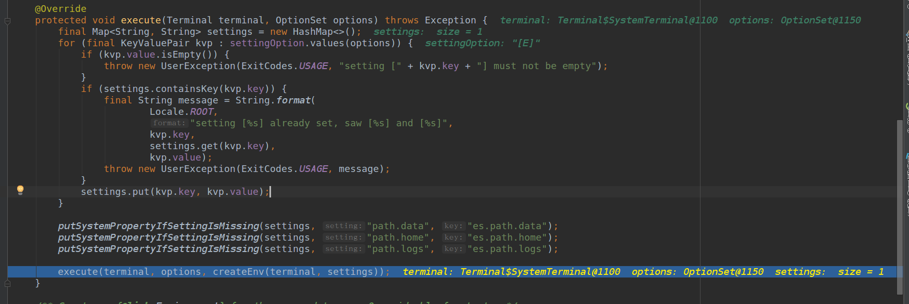
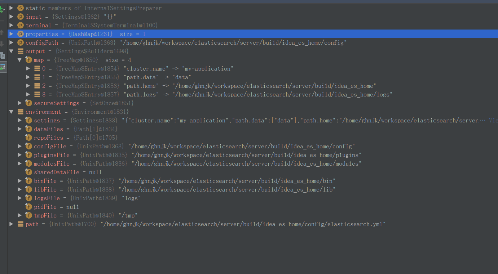

# ES启动过程


## 启动类

  - server 工程下的 org.elasticsearch.bootstrap.Elasticsearch
  - main函数入口

```
    /**
     * Main entry point for starting elasticsearch
     */
    public static void main(final String[] args) throws Exception {
        overrideDnsCachePolicyProperties();
        /*
         * We want the JVM to think there is a security manager installed so that if internal policy decisions that would be based on the
         * presence of a security manager or lack thereof act as if there is a security manager present (e.g., DNS cache policy). This
         * forces such policies to take effect immediately.
         */
        System.setSecurityManager(new SecurityManager() {

            @Override
            public void checkPermission(Permission perm) {
                // grant all permissions so that we can later set the security manager to the one that we want
            }

        });
        LogConfigurator.registerErrorListener();
        final Elasticsearch elasticsearch = new Elasticsearch();
        int status = main(args, elasticsearch, Terminal.DEFAULT);
        if (status != ExitCodes.OK) {
            exit(status);
        }
    }
```

  - 设置dns ttl， java security managr后，创建一个Elasticsearch实例。Elasticsearch实例。Elasticsearch继承了EnvironmentAwareCommand（需要解析环境变量相关的命令类）

    

  - command 类作为基础命令类入口函数

    

    

    注册关闭钩子，执行子类初始化是设置的beforeMain。然后解析命令行选项，设置terminal输出级别。最后执行execute方法。

  - 对于EnvironmentAwareCommand类的execute过程主要如下：

        
    先从命令行选项的E选项解析为设置，并且尝试从环境变量中解析出
    ```
    es.path.data  -> path.data
    es.path.home  -> path.home
    es.path.logs  -> path.logs
    ```

  - 接下来调用createEnv创建环境变量类。
    从加载es.path.conf指定的目录下加载配置文件.解析es设置

    

  - 有了org.elasticsearch.env.Environment这个实例后， EnvironmentAwareCommand会调用子类的excute方法执行excute。而Elasticsearch的execute方法执行调用了Bootstrap类的init方法

## Bootstrap类


  - Bootstrap.init会创建一个boostrap实例。启动类一个keepAlive线程。

    ```
    /** creates a new instance */
    Bootstrap() {
        keepAliveThread = new Thread(new Runnable() {
            @Override
            public void run() {
          d           try {
                    keepAliveLatch.await();
                } catch (InterruptedException e) {
                    // bail out
                }
            }
        }, "elasticsearch[keepAlive/" + Version.CURRENT + "]");
        keepAliveThread.setDaemon(false);
        // keep this thread alive (non daemon thread) until we shutdown
        Runtime.getRuntime().addShutdownHook(new Thread() {
            @Override
            public void run() {
                keepAliveLatch.countDown();
            }
        });
    }
    ```
    
    接下来主要是加载SecureSettings，Log配置初始化， 创建pid文件， 关闭输入输出流， 校验lucecene jar包， 接下调用initializeNatives来初始化一些native资源。

  - initializeNatives函数主要是检测当前用户是非root执行，mlockall，最大线程数，最大虚拟内存大小， 文件最大字节数，初始化lucence的随机数种子.

    

  - Boostrap接下来会注册shutdownhook来销毁node对象。

  - 在所有这些初始化native等资源后， 会配置java sercurity manager

  - 接下来会创建一个org.elasticsearch.node.Node实例

## Node类

### 节点初始化

- node实例初始化，创建节点过程的主要工作是创建各个模块对象和服务对象，**完成 Guice 依赖绑定**，获取并初始化探测器。

```
1) 获取/恢复node名
2) 获取jvm和版本信息，并打印
3) 初始化PluginService (先从classpath加载插件，再加载module目录下的插件，加载plugin目录下的插件)
```


```
4) 校验过期的插件
5) 创建DiscoveryNodeFactory用于集群节点发现
6) 根据最后的配置信息，创建environment对象
7) 创建线程池资源
8) 创建NodeClient用于执行本地的action
9) 创建ResourceWatcherService
10) 创建ScriptModule
11) 创建AnalysisModule
12) 创建NetworkService
13) 创建ClusterService
14) 创建IngestService
15) 各种资源监控service
16) 创建CircuitBreakerService
17) MetaDataCreateIndexService, IndicesService等创建
18) 根据ActionModule创建RestController。创建HttpServerTransport
```

- ModulesBuilder 用于统一管理 Module

```

            ModulesBuilder modules = new ModulesBuilder();
            // plugin modules must be added here, before others or we can get crazy injection errors...
            for (Module pluginModule : pluginsService.createGuiceModules()) {
                modules.add(pluginModule);
            }
            final MonitorService monitorService = new MonitorService(settings, nodeEnvironment, threadPool, clusterInfoService);
            ClusterModule clusterModule = new ClusterModule(settings, clusterService, clusterPlugins, clusterInfoService);
            modules.add(clusterModule);
            IndicesModule indicesModule = new IndicesModule(pluginsService.filterPlugins(MapperPlugin.class));
            modules.add(indicesModule);

            SearchModule searchModule = new SearchModule(settings, false, pluginsService.filterPlugins(SearchPlugin.class));
            CircuitBreakerService circuitBreakerService = createCircuitBreakerService(settingsModule.getSettings(),
                settingsModule.getClusterSettings());
            resourcesToClose.add(circuitBreakerService);
            modules.add(new GatewayModule());

            PageCacheRecycler pageCacheRecycler = createPageCacheRecycler(settings);
            BigArrays bigArrays = createBigArrays(pageCacheRecycler, circuitBreakerService);
            resourcesToClose.add(pageCacheRecycler);
            modules.add(settingsModule);
            
            ActionModule actionModule = new ActionModule(false, settings, clusterModule.getIndexNameExpressionResolver(),
                settingsModule.getIndexScopedSettings(), settingsModule.getClusterSettings(), settingsModule.getSettingsFilter(),
                threadPool, pluginsService.filterPlugins(ActionPlugin.class), client, circuitBreakerService, usageService);
            modules.add(actionModule);
            
            ...
            
			modules.add(b -> {
                    b.bind(Node.class).toInstance(this);
                    b.bind(NodeService.class).toInstance(nodeService);
                    b.bind(NamedXContentRegistry.class).toInstance(xContentRegistry);
                    b.bind(PluginsService.class).toInstance(pluginsService);
                    b.bind(Client.class).toInstance(client);
                    b.bind(NodeClient.class).toInstance(client);
                    b.bind(Environment.class).toInstance(this.environment);
                    b.bind(ThreadPool.class).toInstance(threadPool);
                    b.bind(NodeEnvironment.class).toInstance(nodeEnvironment);
                    b.bind(ResourceWatcherService.class).toInstance(resourceWatcherService);
                    b.bind(CircuitBreakerService.class).toInstance(circuitBreakerService);
                    b.bind(BigArrays.class).toInstance(bigArrays);
                    b.bind(PageCacheRecycler.class).toInstance(pageCacheRecycler);
                    b.bind(ScriptService.class).toInstance(scriptModule.getScriptService());
                    b.bind(AnalysisRegistry.class).toInstance(analysisModule.getAnalysisRegistry());
                    b.bind(IngestService.class).toInstance(ingestService);
                    b.bind(UsageService.class).toInstance(usageService);
                    b.bind(NamedWriteableRegistry.class).toInstance(namedWriteableRegistry);
                    b.bind(MetaDataUpgrader.class).toInstance(metaDataUpgrader);
                    b.bind(MetaStateService.class).toInstance(metaStateService);
                    b.bind(IndicesService.class).toInstance(indicesService);
                    b.bind(AliasValidator.class).toInstance(aliasValidator);
                    b.bind(MetaDataCreateIndexService.class).toInstance(metaDataCreateIndexService);
                    b.bind(SearchService.class).toInstance(searchService);
                    b.bind(SearchTransportService.class).toInstance(searchTransportService);
                    b.bind(SearchPhaseController.class).toInstance(new SearchPhaseController(searchService::createReduceContext));
                    b.bind(Transport.class).toInstance(transport);
                    b.bind(TransportService.class).toInstance(transportService);
                    b.bind(NetworkService.class).toInstance(networkService);
                    b.bind(UpdateHelper.class).toInstance(new UpdateHelper(scriptModule.getScriptService()));
                    b.bind(MetaDataIndexUpgradeService.class).toInstance(metaDataIndexUpgradeService);
                    b.bind(ClusterInfoService.class).toInstance(clusterInfoService);
                    b.bind(GatewayMetaState.class).toInstance(gatewayMetaState);
                    b.bind(Discovery.class).toInstance(discoveryModule.getDiscovery());
                    {
                        RecoverySettings recoverySettings = new RecoverySettings(settings, settingsModule.getClusterSettings());
                        processRecoverySettings(settingsModule.getClusterSettings(), recoverySettings);
                        b.bind(PeerRecoverySourceService.class).toInstance(new PeerRecoverySourceService(transportService,
                                indicesService, recoverySettings));
                        b.bind(PeerRecoveryTargetService.class).toInstance(new PeerRecoveryTargetService(threadPool,
                                transportService, recoverySettings, clusterService));
                    }
-                    httpBind.accept(b);
                    pluginComponents.stream().forEach(p -> b.bind((Class) p.getClass()).toInstance(p));
                    b.bind(PersistentTasksService.class).toInstance(persistentTasksService);
                    b.bind(PersistentTasksClusterService.class).toInstance(persistentTasksClusterService);
                    b.bind(PersistentTasksExecutorRegistry.class).toInstance(registry);
                }
            );
            injector = modules.createInjector();

```

- 主要的服务类简介如下：

  | 服务                       | 简介                                         |
  | :------------------------- | :------------------------------------------- |
  | ResourceWatcherService     | 通用资源监视服务                             |
  | HttpServerTransport        | HTTP传输服务，提供Rest接口服务               |
  | SnapshotsService           | 快照服务                                     |
  | SnapshotShardsService      | 负责启动和停止shard级快照                    |
  | IndicesClusterStateService | 根据收到的集群状态信息，处理相关索引         |
  | Discovery                  | 集群拓扑管理                                 |
  | RoutingService             | 处理路由（节点之间迁移shard）                |
  | ClusterService             | 集群管理服务，主要处理集群任务，发布集群状态 |
  | NodeConnectionsService     | 节点连接管理服务                             |
  | MonitorService             | 提供进程级、系统级、文件系统和JVM的监控服务  |
  | GatewayService             | 负责集群元数据持久化与恢复                   |
  | SearchService              | 处理搜索请求                                 |
  | TransportService           | 底层传输服务                                 |
  | plugins                    | 插件                                         |
  | IndicesService             | 负责创建、删除索引等索引操作                 |

### 启动节点

启动节点的主要工作是启动各个模块的服务对象，服务对象从注入器 `injector` 中取出来，然后调用它们的 `start` 方法，服务对象的 `start` 方法的工作基本是初始化内部数据、创建线程池、启动线程池等，

```
        injector.getInstance(MappingUpdatedAction.class).setClient(client);
        injector.getInstance(IndicesService.class).start();
        injector.getInstance(IndicesClusterStateService.class).start();
        injector.getInstance(SnapshotsService.class).start();
        injector.getInstance(SnapshotShardsService.class).start();
        injector.getInstance(RoutingService.class).start();
        injector.getInstance(SearchService.class).start();
        nodeService.getMonitorService().start();
        
        // Start the transport service now so the publish address will be added to the local disco node in ClusterService
        TransportService transportService = injector.getInstance(TransportService.class);
        transportService.getTaskManager().setTaskResultsService(injector.getInstance(TaskResultsService.class));
        transportService.start();
        assert localNodeFactory.getNode() != null;

```

在启动 Discovery 和 ClusterService 之前，还会调用 validateNodeBeforeAcceptingRequests 方法来检测环境外部，外部环境主要是JVM、操作系统相关参数，将一些影响性能的配置标记为错误以引起用户的重视。

```
    /**
     * Hook for validating the node after network
     * services are started but before the cluster service is started
     * and before the network service starts accepting incoming network
     * requests.
     *
     * @param context               the bootstrap context for this node
     * @param boundTransportAddress the network addresses the node is
     *                              bound and publishing to
     */
    @SuppressWarnings("unused")
    protected void validateNodeBeforeAcceptingRequests(
        final BootstrapContext context,
        final BoundTransportAddress boundTransportAddress, List<BootstrapCheck> bootstrapChecks) throws NodeValidationException {
    }
```

### 环境检测

节点的环境检测代码都封装在 BootstrapChecks 类中，BootstrapChecks 类通过责任链模式对十几个检测项进行检测

```

    // the list of checks to execute
    static List<BootstrapCheck> checks() {
        final List<BootstrapCheck> checks = new ArrayList<>();
        checks.add(new HeapSizeCheck());
        final FileDescriptorCheck fileDescriptorCheck
            = Constants.MAC_OS_X ? new OsXFileDescriptorCheck() : new FileDescriptorCheck();
        checks.add(fileDescriptorCheck);
        checks.add(new MlockallCheck());
        if (Constants.LINUX) {
            checks.add(new MaxNumberOfThreadsCheck());
        }
        if (Constants.LINUX || Constants.MAC_OS_X) {
            checks.add(new MaxSizeVirtualMemoryCheck());
        }
        if (Constants.LINUX || Constants.MAC_OS_X) {
            checks.add(new MaxFileSizeCheck());
        }
        if (Constants.LINUX) {
            checks.add(new MaxMapCountCheck());
        }
        checks.add(new ClientJvmCheck());
        checks.add(new UseSerialGCCheck());
        checks.add(new SystemCallFilterCheck());
        checks.add(new OnErrorCheck());
        checks.add(new OnOutOfMemoryErrorCheck());
        checks.add(new EarlyAccessCheck());
        checks.add(new G1GCCheck());
        checks.add(new AllPermissionCheck());
        return Collections.unmodifiableList(checks);
    }
```

**那么检查项有哪些呢？**

- `堆大小检查`：如果开启了`bootstrap.memory_lock`，则JVM在启动时将锁定堆的初始大小，若配置的初始值与最大值不等，堆变化后无法保证堆都锁定在内存中
- `文件描述符检查`：ES进程需要非常多的文件描述符，所以须配置系统的文件描述符的最大数量 `ulimit -n 65535`
- `内存锁定检查`：ES允许进程只使用物理内存，若使用交换分区可能会带来很多问题，所以最好让ES锁定内存
- `最大线程数检查`：ES进程会创建很多线程，这个数最少需2048
- `最大虚拟内存检查`
- `最大文件大小检查`：段文件和事务日志文件可能会非常大，建议这个数设置为无限
- `虚拟内存区域最大数量检查`
- `JVM Client模式检查`
- `串行收集检查`：ES默认使用 CMS 垃圾回收器，而不是 Serial 收集器
- `系统调用过滤器检查`
- `OnError与OnOutOfMemoryError检查`
- `Early-access检查`：ES最好运行在JVM的稳定版本上
- `G1GC检查`


G1GC算法问题：

```

    /**
     * Bootstrap check for versions of HotSpot that are known to have issues that can lead to index corruption when G1GC is enabled.
     */
    static class G1GCCheck implements BootstrapCheck {

        @Override
        public BootstrapCheckResult check(BootstrapContext context) {
            if ("Oracle Corporation".equals(jvmVendor()) && isJava8() && isG1GCEnabled()) {
                final String jvmVersion = jvmVersion();
                // HotSpot versions on Java 8 match this regular expression; note that this changes with Java 9 after JEP-223
                final Pattern pattern = Pattern.compile("(\\d+)\\.(\\d+)-b\\d+");
                final Matcher matcher = pattern.matcher(jvmVersion);
                final boolean matches = matcher.matches();
                assert matches : jvmVersion;
                final int major = Integer.parseInt(matcher.group(1));
                final int update = Integer.parseInt(matcher.group(2));
                // HotSpot versions for Java 8 have major version 25, the bad versions are all versions prior to update 40
                if (major == 25 && update < 40) {
                    final String message = String.format(
                            Locale.ROOT,
                            "JVM version [%s] can cause data corruption when used with G1GC; upgrade to at least Java 8u40", jvmVersion);
                    return BootstrapCheckResult.failure(message);
                }
            }
            return BootstrapCheckResult.success();
        }

```

### ThreadPool创建

```

    public ThreadPool(final Settings settings, final ExecutorBuilder<?>... customBuilders) {
        assert Node.NODE_NAME_SETTING.exists(settings);

        final Map<String, ExecutorBuilder> builders = new HashMap<>();
        final int availableProcessors = EsExecutors.numberOfProcessors(settings);
        final int halfProcMaxAt5 = halfNumberOfProcessorsMaxFive(availableProcessors);
        final int halfProcMaxAt10 = halfNumberOfProcessorsMaxTen(availableProcessors);
        final int genericThreadPoolMax = boundedBy(4 * availableProcessors, 128, 512);
        builders.put(Names.GENERIC, new ScalingExecutorBuilder(Names.GENERIC, 4, genericThreadPoolMax, TimeValue.timeValueSeconds(30)));
        builders.put(Names.INDEX, new FixedExecutorBuilder(settings, Names.INDEX, availableProcessors, 200, true));
        builders.put(Names.WRITE, new FixedExecutorBuilder(settings, Names.WRITE, "bulk", availableProcessors, 200));
        builders.put(Names.GET, new FixedExecutorBuilder(settings, Names.GET, availableProcessors, 1000));
        builders.put(Names.ANALYZE, new FixedExecutorBuilder(settings, Names.ANALYZE, 1, 16));
        builders.put(Names.SEARCH, new AutoQueueAdjustingExecutorBuilder(settings,
                        Names.SEARCH, searchThreadPoolSize(availableProcessors), 1000, 1000, 1000, 2000));
        builders.put(Names.SEARCH_THROTTLED, new AutoQueueAdjustingExecutorBuilder(settings,
            Names.SEARCH_THROTTLED, 1, 100, 100, 100, 200));
        builders.put(Names.MANAGEMENT, new ScalingExecutorBuilder(Names.MANAGEMENT, 1, 5, TimeValue.timeValueMinutes(5)));
        // no queue as this means clients will need to handle rejections on listener queue even if the operation succeeded
        // the assumption here is that the listeners should be very lightweight on the listeners side
        builders.put(Names.LISTENER, new FixedExecutorBuilder(settings, Names.LISTENER, halfProcMaxAt10, -1));
        builders.put(Names.FLUSH, new ScalingExecutorBuilder(Names.FLUSH, 1, halfProcMaxAt5, TimeValue.timeValueMinutes(5)));
        builders.put(Names.REFRESH, new ScalingExecutorBuilder(Names.REFRESH, 1, halfProcMaxAt10, TimeValue.timeValueMinutes(5)));
        builders.put(Names.WARMER, new ScalingExecutorBuilder(Names.WARMER, 1, halfProcMaxAt5, TimeValue.timeValueMinutes(5)));
        builders.put(Names.SNAPSHOT, new ScalingExecutorBuilder(Names.SNAPSHOT, 1, halfProcMaxAt5, TimeValue.timeValueMinutes(5)));
        builders.put(Names.FETCH_SHARD_STARTED,
                new ScalingExecutorBuilder(Names.FETCH_SHARD_STARTED, 1, 2 * availableProcessors, TimeValue.timeValueMinutes(5)));
        builders.put(Names.FORCE_MERGE, new FixedExecutorBuilder(settings, Names.FORCE_MERGE, 1, -1));
        builders.put(Names.FETCH_SHARD_STORE,
                new ScalingExecutorBuilder(Names.FETCH_SHARD_STORE, 1, 2 * availableProcessors, TimeValue.timeValueMinutes(5)));
        for (final ExecutorBuilder<?> builder : customBuilders) {
            if (builders.containsKey(builder.name())) {
                throw new IllegalArgumentException("builder with name [" + builder.name() + "] already exists");
            }
            builders.put(builder.name(), builder);
        }
        this.builders = Collections.unmodifiableMap(builders);

        threadContext = new ThreadContext(settings);

        final Map<String, ExecutorHolder> executors = new HashMap<>();
        for (@SuppressWarnings("unchecked") final Map.Entry<String, ExecutorBuilder> entry : builders.entrySet()) {
            final ExecutorBuilder.ExecutorSettings executorSettings = entry.getValue().getSettings(settings);
            final ExecutorHolder executorHolder = entry.getValue().build(executorSettings, threadContext);
            if (executors.containsKey(executorHolder.info.getName())) {
                throw new IllegalStateException("duplicate executors with name [" + executorHolder.info.getName() + "] registered");
            }
            logger.debug("created thread pool: {}", entry.getValue().formatInfo(executorHolder.info));
            executors.put(entry.getKey(), executorHolder);
        }

        executors.put(Names.SAME, new ExecutorHolder(DIRECT_EXECUTOR, new Info(Names.SAME, ThreadPoolType.DIRECT)));
        this.executors = unmodifiableMap(executors);
        this.scheduler = Scheduler.initScheduler(settings);
        TimeValue estimatedTimeInterval = ESTIMATED_TIME_INTERVAL_SETTING.get(settings);
        this.cachedTimeThread = new CachedTimeThread(EsExecutors.threadName(settings, "[timer]"), estimatedTimeInterval.millis());
        this.cachedTimeThread.start();
```

线程池类型 ThreadPoolType
fixed（固定）：fixed线程池拥有固定数量的线程来处理请求，在没有空闲线程时请求将被挂在队列中。queue_size参数可以控制在没有空闲线程时，能排队挂起的请求数

fixed_auto_queue_size：此类型为实验性的，将被更改或删除，不关注

scaling（弹性）：scaling线程池拥有的线程数量是动态的，这个数字介于core和max参数的配置之间变化。keep_alive参数用来控制线程在线程池中空闲的最长时间

direct：此类线程是一种不支持关闭的线程,就意味着一旦使用,则会一直存活下去.

一些重要的线程池

**generic**：用于通用的请求（例如：后台节点发现），线程池类型为 scaling。

**index**：用于index/delete请求，线程池类型为 fixed， 大小的为处理器数量，队列大小为200，最大线程数为 1 + 处理器数量。

**search**：用于count/search/suggest请求。线程池类型为 fixed， 大小的为 int((处理器数量 3) / 2) +1，队列大小为1000。*

**get**：用于get请求。线程池类型为 fixed，大小的为处理器数量，队列大小为1000。

**analyze**：用于analyze请求。线程池类型为 fixed，大小的1，队列大小为16

**write**：用于单个文档的 index/delete/update 请求以及 **bulk 请求**，线程池类型为 fixed，大小的为处理器数量，队列大小为200，最大线程数为 1 + 处理器数量。

**snapshot**：用于snaphost/restore请求。线程池类型为 scaling，线程保持存活时间为5分钟，最大线程数为min(5, (处理器数量)/2)。

**warmer**：用于segment warm-up请求。线程池类型为 scaling，线程保持存活时间为5分钟，最大线程数为min(5, (处理器数量)/2)。

**refresh**：用于refresh请求。线程池类型为 scaling，线程空闲保持存活时间为5分钟，最大线程数为min(10, (处理器数量)/2)。

**listener**：主要用于Java客户端线程监听器被设置为true时执行动作。线程池类型为 scaling，最大线程数为min(10, (处理器数量)/2)。

ThreadPool 类中除了以上线程队列，还可以看到有 CachedTimeThread（缓存系统时间）、ExecutorService（在当前线程上执行提交的任务）、ThreadContext（线程上下文）、ScheduledThreadPoolExecutor（Java任务调度）等


### keepalive

keepAliveThread 线程本身不做具体的工作。主线程执行完启动流程后会退出，keepAliveThread 线程是唯一的用户线程，**作用是保持进程运行**。在Java程序中，一个进程至少需要有一个用户线程，当用户线程为零时将退出进程。

做个试验，将 `keepAliveThread.setDaemon(false);` 中的 `false` 改为 `true`，会发现Elasticsearch启动后马上就停止了


```
        keepAliveThread = new Thread(new Runnable() {
            @Override
            public void run() {
                try {
                    keepAliveLatch.await();
                } catch (InterruptedException e) {
                    // bail out
                }
            }
        }, "elasticsearch[keepAlive/" + Version.CURRENT + "]");
        keepAliveThread.setDaemon(false);
```


### 节点关闭

关闭的顺序大致为：

- 关闭快照和HTTPServer，不再响应用户REST请求

- 关闭集群拓扑管理，不再响应ping请求

- 关闭网络模块，让节点离线

- 执行各个插件的关闭流程

- 关闭IndicesService，这期间需要等待释放的资源最多，时间最长

  