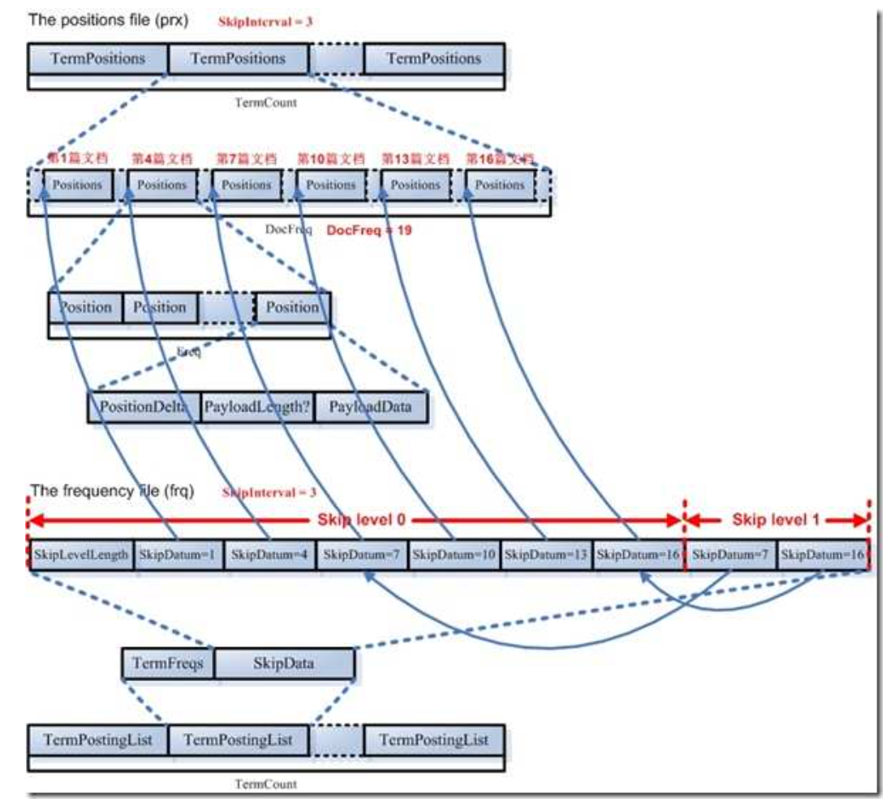

# 存储结构

## 基础概念

### 跳跃表

    为了提高查找的性能，Lucene 在很多地方采取的跳跃表的数据结构。跳跃表\(Skip List\)是如图的一种数据结构，有以下几个基本特征：

* 元素是按顺序排列的，在 Lucene 中，或是按字典顺序排列，或是按从小到大顺序排列。 
* 跳跃是有间隔的\(Interval\)，也即每次跳跃的元素数，间隔是事先配置好的，如图跳跃表 的间隔为 3。
* 跳跃表是由层次的\(level\)，每一层的每隔指定间隔的元素构成上一层，如图跳跃表共有 2 层。

### 倒排索引

    左边保存的是一系列字符串，称为词典。 每个字符串都指向包 此字符串的文档\(Document\)链表，此文档链表称为倒排表\(Posting List\)。有了索引，便使保存的信息和要搜索的信息一致，可以大大加快搜索的速度。

## 总体结构

    lecene内部是分段存储的。从上到下可以分为如下几个层次：

* index： 索引。一个索引一个目录，包含赌多个段
* segment： 段。段没有固定的大小。一般新加入的文档放在最近的段， 随着段的增加， 触发段合并。将多个大小相近的段合并成一个大的段。 段中存储着多个文档的数据和正向，逆向索引信息。
* document： 文档。一个文档包含多个域。例如title，abstract，author，content等。
* field： 域中存储了具体的数据。可以包含多个词
* term： 词。在搜索中不可拆分的单元。

    lucene不仅仅包含了从index到segment到document到field一直到field的正向信息。 还保存了从term到document的逆向信息加速搜索。 下图展示了lucene索引文件的总体结构：

    属于整个索引\(Index\)的 segment.gen，segment\_N，其保存的是段\(segment\)的元数据信息，然后分多个 segment 保存数据信息，同一个 segment 有相同的前缀文件名。

    对于每一个段，包 域信息，词信息，以及其他信息\(标准化因子，删除文档\)。域信息也包括域的元数据信息，在 fnm 中，域的数据信息，在 fdx，fdt 中。

    词信息是反向信息，包括词典\(tis, tii\)，文档号及词频倒排表\(frq\)，词位置倒排表\(prx\)。

## 域信息存储结构（fdt,fdx\)

域数据文件\(fdt\):

* 真正保存存储域\(stored field\)信息的是 fdt 文件
* 在一个段\(segment\)中总共有 segment size 篇文档，所以 fdt 文件中共有 segment size个项，每一项保存一篇文档的域的信息
* 对于每一篇文档，一开始是一个 fieldcount，也即此文档包 的域的数目，接下来 66 是 fieldcount 个项，每一项保存一个域的信息。
* 对于每一个域，fieldnum 是域号，接着是一个 8 位的 byte，最低一位表示此域是否分词\(tokenized\)，倒数第二位表示此域是保存字符串数据还是二进制数据，倒数第 三位表示此域是否被压缩，再接下来就是存储域的值，比如 new Field\("title", "lucene in action", Field.Store.Yes, ...\)，则此处存放的就是"lucene in action"这个字符串。

域索引文件\(fdx\)：

* 由域数据文件格式我们知道，每篇文档包 的域的个数，每个存储域的值都是不一样的，因而域数据文件中 segment size 篇文档，每篇文档占用的大小也是不一样的， 那么如何在 fdt 中辨 每一篇文档的起始地址和终止地址呢，如何能够更快的找到 第 n 篇文档的存储域的信息呢?就是要借助域索引文件。
* 域索引文件也总共有 segment size 个项，每篇文档都有一个项，每一项都是一个 long，大小固定，每一项都是对应的文档在 fdt 文件中的起始地址的偏移量，这样 如果我们想找到第 n 篇文档的存储域的信息，只要在 fdx 中找到第 n 项，然后按照 取出的 long 作为偏移量，就可以在 fdt 文件中找到对应的存储域的信息。

## 词向量数据信息（tvx, tvf, tvd）

    词向量信息是从索引\(index\)到文档\(document\)到域\(field\)到词\(term\)的正向信息，有了词向量 信息，我们就可以得到一篇文档包 那些词的信息。

词向量索引文件\(tvx\)：

* 一个段\(segment\)包 N 篇文档，此文件就有 N 项，每一项代表一篇文档。
* 每一项包 两部分信息:第一部分是词向量文档文件\(tvd\)中此文档的偏移量，第二 部分是词向量域文件\(tvf\)中此文档的第一个域的偏移量。

词向量文档文件\(tvd\)：

* 一个段\(segment\)包 N 篇文档，此文件就有 N 项，每一项包 了此文档的所有的 域的信息。
* 每一项首先是此文档包 的域的个数 NumFields，然后是一个 NumFields 大小的数组，数组的每一项是域号。然后是一个\(NumFields - 1\)大小的数组，由前面我们知 道，每篇文档的第一个域在 tvf 中的偏移量在 tvx 文件中保存，而其他\(NumFields - 1\) 个域在 tvf 中的偏移量就是第一个域的偏移量加上这\(NumFields - 1\)个数组的每一 项的值。

词向量域文件\(tvf\)：

* 此文件包 了此段中的所有的域，并不对文档做区分，到底第几个域到第几个域是属于那篇文档，是由 tvx 中的第一个域的偏移量以及 tvd 中的\(NumFields - 1\)个域的偏移量来决定的。
* 对于每一个域，首先是此域包 的词的个数 NumTerms，然后是一个 8 位的 byte，最后一位是指定是否保存位置信息，倒数第二位是指定是否保存偏移量信息。然后 是 NumTerms 个项的数组，每一项代表一个词\(Term\)，对于每一个词，由词的文本 TermText，词频 TermFreq\(也即此词在此文档中出现的次数\)，词的位置信息，词的 偏移量信息。

## 反向索引信息，词典（tis）和词典索引（tii）信息

    在词典中，所有的词是按照字典顺序排序的。 

词典文件\(tis\)：

* TermCount:词典中包 的总的词数
* IndexInterval:为了加快对词的查找速度，也应用类似跳跃表的结构，假设IndexInterval 为 4，则在词典索引\(tii\)文件中保存第 4 个，第 8 个，第 12 个词，这 样可以加快在词典文件中查找词的速度。
* SkipInterval:倒排表无论是文档号及词频，还是位置信息，都是以跳跃表的结构存在的，SkipInterval 是跳跃的步数。
* MaxSkipLevels:跳跃表是多层的，这个值指的是跳跃表的最大层数。
* TermCount 个项的数组，每一项代表一个词，对于每一个词，以前缀后缀规则存放词的文本信息\(PrefixLength + Suffix\)，词属于的域的域号\(FieldNum\)，有多少篇文档 包 此词\(DocFreq\)，此词的倒排表在 frq，prx 中的偏移量\(FreqDelta, ProxDelta\)，此 词的倒排表的跳跃表在 frq 中的偏移量\(SkipDelta\)，这里之所以用 Delta，是应用差 值规则。

词典索引文件\(tii\)：

* 词典索引文件是为了加快对词典文件中词的查找速度，保存每隔 IndexInterval 个词。
* 词典索引文件是会被全部加载到内存中去的。
* IndexTermCount = TermCount / IndexInterval:词典索引文件中包 的词数。
* IndexInterval 同词典文件中的 IndexInterval。
* SkipInterval 同词典文件中的 SkipInterval。
* MaxSkipLevels 同词典文件中的 MaxSkipLevels。
* IndexTermCount 个项的数组，每一项代表一个词，每一项包括两部分，第一部分是词本身\(TermInfo\)，第二部分是在词典文件中的偏移量\(IndexDelta\)。假设 IndexInterval 为 4，此数组中保存第 4 个，第 8 个，第 12 个词。。

## 倒排列表，文档号和词频（freq）信息

    文档号及词频文件里面保存的是倒排表，是以跳跃表形式存在的。

* 此文件包 TermCount 个项，每一个词都有一项，因为每一个词都有自己的倒排表。
* 对于每一个词的倒排表都包括两部分，一部分是倒排表本身，也即一个数组的文档号及词频，另一部分是跳跃表，为了更快的访问和定位倒排表中文档号及词频的位置。

## 词位置（prx）信息

  
    词位置信息也是倒排表，也是以跳跃表形式存在的。

* 此文件包 TermCount 个项，每一个词都有一项，因为每一个词都有自己的词位置倒排表。
* 对于每一个词的都有一个 DocFreq 大小的数组，每项代表一篇文档，记录此文档中此词出现的位置。这个文档数组也是和 frq 文件中的跳跃表有关系的，从上面我们知道，在 frq 的跳跃表节点中有 ProxSkip，当 SkipInterval 为 3 的时候，frq 的跳跃表节点指向 prx 文件中的此数组中的第 1，第 4，第 7，第 10，第 13，第 16 篇文档。
* 对于每一篇文档，可能包 一个词多次，因而有一个 Freq 大小的数组，每一项代表此 词在此文档中出现一次，则有一个位置信息。
* 每一个位置信息包 :PositionDelta\(采用差值规则\)，还可以保存 payload，应用或然跟 随规则。

## 删除的文档信息文件（del）

    被删除文档文件\(Deleted Document File: .del\)

* Format:在此文件中，Bits 和 DGaps 只能保存其中之一，-1 表示保存 DGaps，非负值表示保存 Bits。
* ByteCount:此段中有多少文档，就有多少个 bit 被保存，但是以 byte 形式计数，也即 Bits 的大小应该是 byte 的倍数。
* BitCount:Bits 中有多少位被至 1，表示此文档已经被删除。
* Bits:一个数组的 byte，大小为 ByteCount，应用时被认为是 byte\*8 个 bit。
* DGaps:如果删除的文档数量很小，则 Bits 大部分位为 0，很浪费空间。DGaps 采用以下的方式来保存稀疏数组:比如第十，十二，三十二个文档被删除，于是第十， 十二，三十二位设为 1，DGaps 也是以 byte 为单位的，仅保存不为 0 的 byte，如第 1 个 byte，第 4 个 byte，第 1 个 byte 十进制为 20，第 4 个 byte 十进制为 1。于是 保存成 DGaps，第 1 个 byte，位置 1 用不定长正整数保存，值为 20 用二进制保存， 第 2 个 byte，位置 4 用不定长正整数保存，用差值为 3，值为 1 用二进制保存，二 进制数据不用差值表示。

